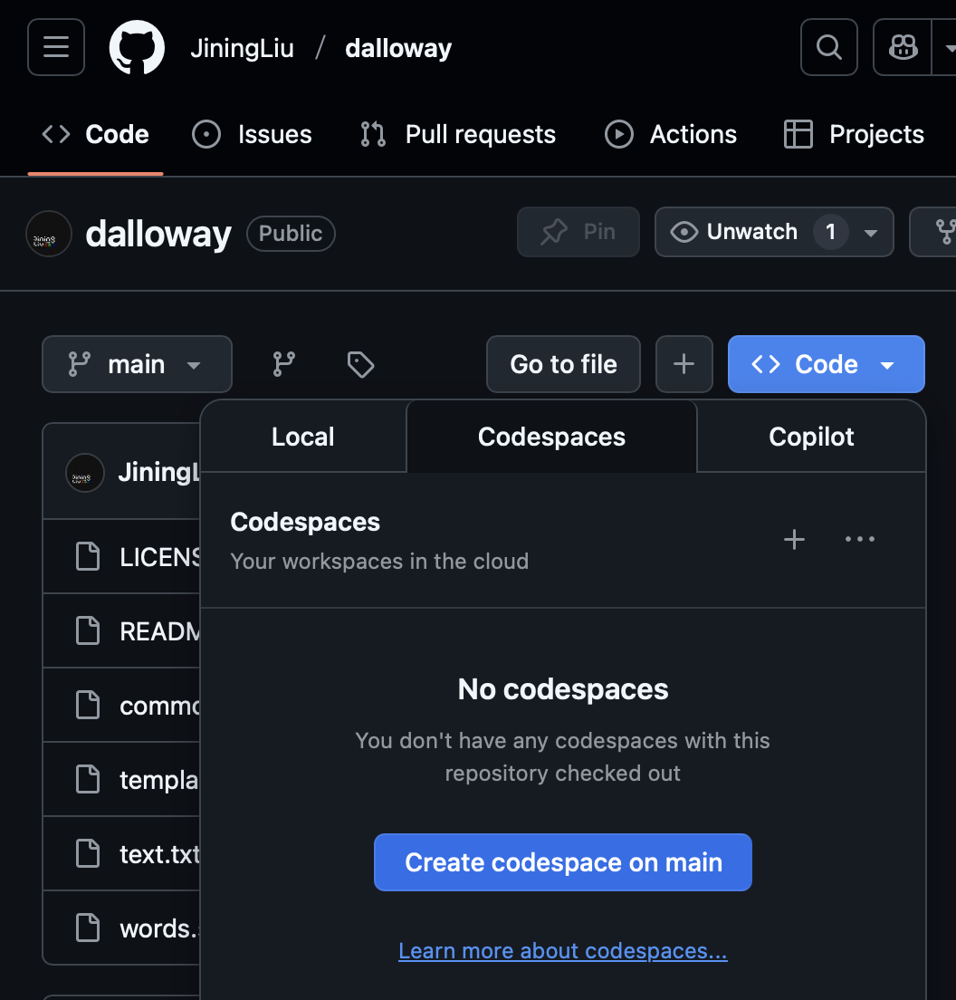

# Dalloway Project

This repository contains the code used for the IB Lit Dalloway analysis project.

## Run Instructions

1. On the home page of this GitHub repository page, above the file explorer, click on the "Code" dropdown.
2. Select the "Codespaces" tab and click "Create codespace on main."



3. In the newly opened window (Codespace), wait for the setup to automatically complete. Once you see these instructions in your Codespace, continue with the next step.
4. In the bottom section of the Codespace page, click on the "Terminal" tab.
5. Copy and paste the following into the terminal, and press enter.
```bash
curl -L https://swiftlang.github.io/swiftly/swiftly-install.sh | bash
```
6. When prompted to select an option for installation, press 1 and then enter.
7. Copy and paste the following into the terminal, and press enter.
```bash
swiftly install latest
```
8. Your Codespace is ready to go. Type `swift words.swift` and press enter in the terminal to run the code!
   - Replace `words.swift` with whatever `.swift` file you would like to run.

## Code Files
- `fsa.swift` - Filtered Sentiment Analysis
- `length.swift` - Find word & occurrences based on sorted length index
- `occurrences.swift` - Find word & occurrences based on sorted occurrences index
- `search.swift` - Search anything in the text
- `word.swift` - Search for a word and returns any exact or partial matches with number of occurrences